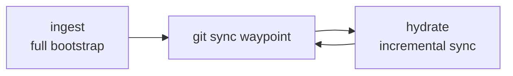

# Agent Skills

Self-authored Cursor / Claude / Codex skills I actually use — memory sync, shipping PRs, and explaining plans without the fog.

**Author:** [Amanjot Singh](https://github.com/amanjotx)

---

## What this is

A small set of agent skills under `skills/<name>/SKILL.md`. Point your agent at them (or symlink into your skills directory) and invoke by name or slash command.

Who it's for: people running Cursor (or Claude / Codex with skills support) who want reusable workflows instead of re-prompting the same ritual every time.

---

## Skills

| Skill | What it does | When to use |
| --- | --- | --- |
| **hydrate** | Incremental sync of Hydra DB project memory from a git waypoint | After you've already ingested — keep memory current without a full remap |
| **ingest** | Full bootstrap map of a codebase into Hydra DB, with a sync waypoint | First time (or reset) for a project — build the memory baseline |
| **ship** | Branch from main, conventional commits, push, open a detailed GitHub PR via `gh` | Ready to land work — want a clean branch + PR, not a dump of diffs |
| **simply** | Re-explain plans and designs in plain language, with analogies and simple diagrams | When a plan is correct but dense — `/simply` until it clicks |

### hydrate & ingest

These two are a pair. **ingest** builds the map; **hydrate** keeps it fresh.



Both need [Hydra DB MCP](https://docs.hydradb.com/plugins/mcp) configured in your agent environment. Configure that separately — this repo does not ship credentials or MCP config.

`hydrate` and `ingest` are typically `disable-model-invocation: true` — invoke them explicitly (slash / skill pick), not as silent auto-tools.

### ship

Uses the GitHub CLI (`gh`). Expects you authenticated and in a git repo. Handles the boring parts: branch off main, commit style, push, PR body with enough context to review.

### simply

Slash-command style: `/simply`. Feed it a plan, design, or architecture dump; get back plain language, analogies, and light diagrams.

---

## Install

Clone, then symlink each skill into your agent skills directory:

```bash
git clone https://github.com/amanjotx/Agent-Skills.git
cd Agent-Skills

mkdir -p ~/.agents/skills

ln -s "$(pwd)/skills/hydrate" ~/.agents/skills/hydrate
ln -s "$(pwd)/skills/ingest"  ~/.agents/skills/ingest
ln -s "$(pwd)/skills/ship"    ~/.agents/skills/ship
ln -s "$(pwd)/skills/simply"  ~/.agents/skills/simply
```

**Cursor:** skills under `~/.agents/skills/<name>` (with a `SKILL.md` inside) are picked up for invocation. You can also open or `@`-reference a `SKILL.md` path directly if your setup prefers that.

**Claude / Codex:** same idea — symlink or copy `skills/<name>` into whatever skills path your client reads, or point the agent at the `SKILL.md` files in this repo.

Only symlink the skills you want. Skip `hydrate` / `ingest` if you aren't using Hydra DB.

---

## Layout

```
skills/
  hydrate/SKILL.md
  ingest/SKILL.md
  ship/SKILL.md
  simply/SKILL.md
```

---

## License

[MIT](./LICENSE) © 2026 Amanjot Singh
