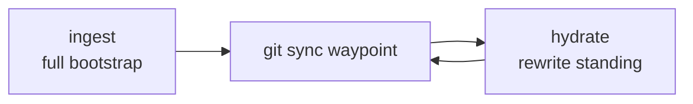

# Agent Skills

Self-authored Cursor / Claude / Codex skills I actually use — memory sync, shipping PRs, and explaining plans without the fog.

**Author:** [Amanjot Singh](https://github.com/amanjotx)

---

## What this is

A small set of agent skills under `skills/<name>/SKILL.md`. Point your agent at them (or symlink into your skills directory) and invoke by name or slash command.

Who it's for: people running Cursor (or Claude / Codex with skills support) who want reusable workflows instead of re-prompting the same ritual every time.

---

## Skills

| Skill | What it does | When to use |
| --- | --- | --- |
| **hydrate** | Incremental rewrite of the one `{project}-standing` Hydra memory from a git waypoint | After you've already ingested — keep standing current without a full remap |
| **ingest** | Full bootstrap: one distilled standing document (problem, destination vs code, wiring) | First time (or reset) for a project — build the memory baseline |
| **ship** | Branch from main, conventional commits, push, open a detailed GitHub PR via `gh` | Ready to land work — want a clean branch + PR, not a dump of diffs |
| **simply** | Re-explain plans and designs in plain language, with analogies and simple diagrams | When a plan is correct but dense — `/simply` until it clicks |

### hydrate & ingest

These two are a pair. **ingest** writes one `{project}-standing` memory (`infer: false`, ≤990 words). **hydrate** rewrites that same id from a git waypoint. Do not spawn sibling memories (`*-codebase-map`, `*-decisions-*`, `*-scars`).

Pin each product repo’s Hydra MCP to its own collection (slug). Personal prefs live in a `personal` collection, not in project standing.



Both need [Hydra DB MCP](https://docs.hydradb.com/plugins/mcp) configured in your agent environment. Configure that separately — this repo does not ship credentials or MCP config.

`hydrate` and `ingest` are typically `disable-model-invocation: true` — invoke them explicitly (slash / skill pick), not as silent auto-tools.

### ship

Uses the GitHub CLI (`gh`). Expects you authenticated and in a git repo. Handles the boring parts: branch off main, commit style, push, PR body with enough context to review.

### simply

Slash-command style: `/simply`. Feed it a plan, design, or architecture dump; get back plain language, analogies, and light diagrams.

---

## Install

This git repo is the **only copy** of these skills. Other product repos should **not** vendor them under `.cursor/skills/`. Symlink once into your user skills dirs so Cursor / Claude / Codex all see the same files.

```bash
git clone https://github.com/amanjotx/Agent-Skills.git
cd Agent-Skills

mkdir -p ~/.agents/skills ~/.cursor/skills ~/.claude/skills

for s in hydrate ingest ship simply; do
  ln -sfn "$(pwd)/skills/$s" ~/.agents/skills/$s
  ln -sfn ~/.agents/skills/$s ~/.cursor/skills/$s
  ln -sfn ~/.agents/skills/$s ~/.claude/skills/$s
done
```

`ln -sfn` replaces an existing file or symlink. If `~/.agents/skills/<name>` is a **real directory** (a stale copy), remove it first: `rm -rf ~/.agents/skills/<name>`.

**Cursor** also reads `~/.cursor/skills/<name>/SKILL.md` (personal, every project) and `<repo>/.cursor/skills/` (project-only, shared with whoever clones that repo). Keep ingest/hydrate/ship/simply personal — they are your workflow, not Shepherd’s product.

**Claude / Codex:** `~/.agents/skills` and `~/.claude/skills` are the usual user paths.

Only symlink the skills you want. Skip `hydrate` / `ingest` if you aren't using Hydra DB.

---

## Layout

```
skills/
  hydrate/SKILL.md
  ingest/SKILL.md
  ship/SKILL.md
  simply/SKILL.md
```

---

## License

[MIT](./LICENSE) © 2026 Amanjot Singh
